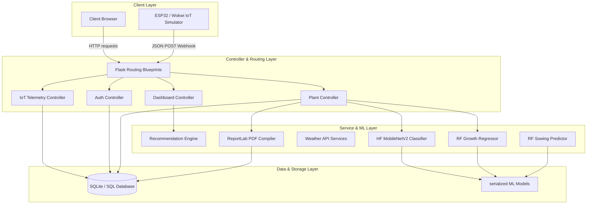
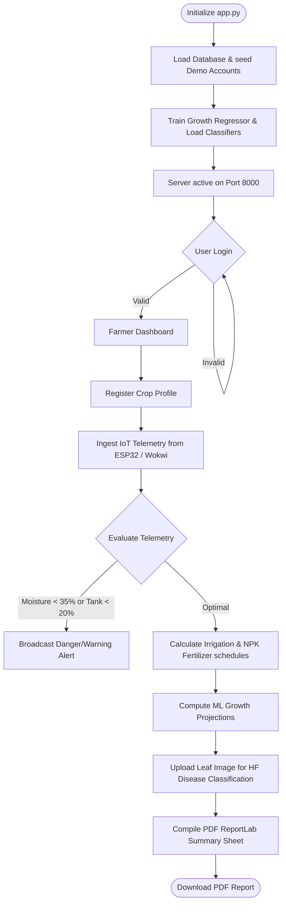
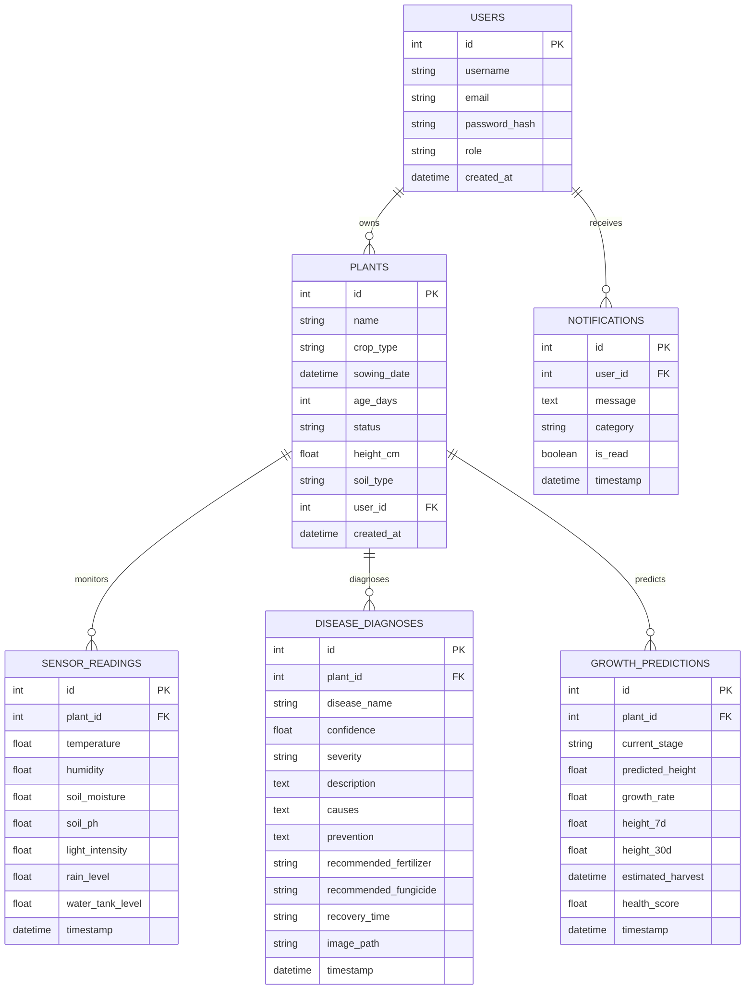

# Intelligent Plant Growth Monitoring and Prediction Framework

An end-to-end precision agriculture capstone project. This framework integrates machine learning predictive models, real-time IoT sensor telemetry streams, automated crop diagnostics, decision-support recommendation engines, PDF report compiling, and role-based user cockpits into a professional MVC Flask application.

---

## 1. System Architecture

The project is structured around the Model-View-Controller (MVC) software design pattern:



---

## 2. Process Flowchart

The plant monitoring lifecycle handles sensor ingestion, predictions, warnings, and PDF downloads:



---

## 3. Entity-Relationship (ER) Diagram

The SQLite schema represents the relational mappings of user data:



---

## 4. Installation & Setup Guide

Ensure Python 3.13 is installed on your Windows machine, then run:

```powershell
# 1. Activate the environment
venv\Scripts\activate

# 2. Install all required dependencies
pip install -r requirements.txt

# 3. Launch the framework
python app.py
```

### Accessing Demo Portals
During database initialization, the framework automatically seeds two demo user profiles:
- **Farmer Portal:** Username: `farmer` | Password: `farmer123`
- **Admin Portal:** Username: `admin` | Password: `admin123`

---

## 5. API Reference Documentation

### Authentication Blueprints
- **`POST /register`**
  Registers a new User credentials profile (fields: `username`, `email`, `password`, `role`).
- **`POST /login`**
  Authenticates sessions and redirects user to dashboard view.

### Crop Registry & Modeling
- **`POST /plants/add`**
  Registers a new crop profile (fields: `name`, `crop_type`, `soil_type`, `height_cm`, `sowing_date`).
- **`POST /plants/<id>/predict`**
  Computes random forest growth projection regression modeling.
- **`POST /plants/<id>/diagnose`**
  Uploads a leaf image and runs Hugging Face disease classification.
- **`GET /plants/<id>/report`**
  Compiles and downloads a formatted PDF report summary sheet.

### Live IoT Integrations
- **`POST /api/telemetry`**
  Receives JSON telemetry from ESP32/Wokwi.
  Format: `{"plant_id": 1, "temperature": 26.5, "humidity": 62, "soil_moisture": 52.3, "soil_ph": 6.8}`
- **`POST /api/telemetry/simulate`**
  Batch updates sensor readings for testing.

---

## 6. Project Report Summary

### Project Goal
Farming often suffers from manual resource allocations, leading to high water wastage and misdiagnosed crop pathogens. The **Intelligent Plant Growth Monitoring and Prediction Framework** provides an integrated precision farming toolkit, replacing guesswork with data-driven machine learning models.

### Key Achievements
1. **End-to-End IoT Telemetry:** Implemented custom animated Gauges and JSON endpoints capable of receiving continuous ESP32 streams.
2. **Machine Learning Growth Modeling:** Generated custom growth profiles and trained a multi-output `Random Forest Regressor` to forecast height progression (7-day and 30-day), growth rates, and health indices.
3. **Farming Advice Engine:** Created algorithmic rules parsing telemetry trends to recommend precise irrigation volumes (in ml) and balanced NPK fertilizer weights.
4. **Structured MVC Design:** Transformed the single-file script into a clean, modular MVC directory hierarchy.
